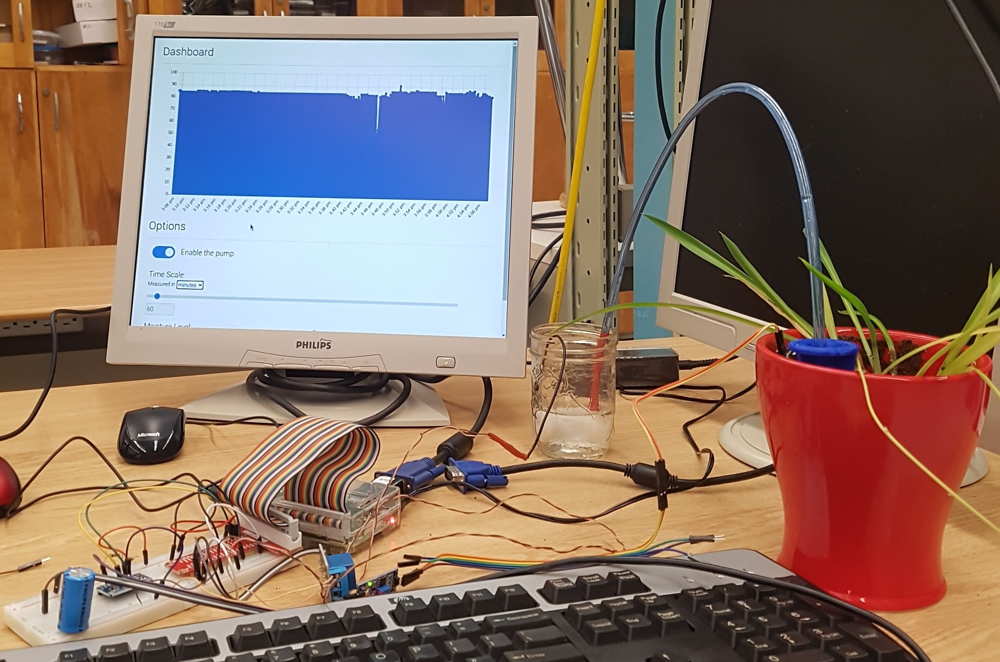

# PlantWatering
Automatic plant watering system on Raspberry Pi with live website user interface, ISP for Grade 12 Computer Engineering

# Images

# Features
- Live soil moisture metrics
- Moisture configuration on website
- Persistent data storage
